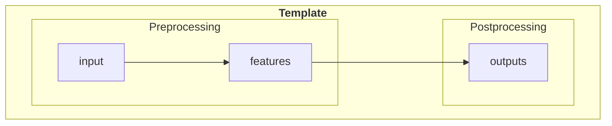

# project_template

## Outline of this README

- [project\_template](#project_template)
  - [Outline of this README](#outline-of-this-readme)
  - [Introduction](#introduction)
  - [Workflow](#workflow)
  - [Project Setup](#project-setup)
  - [Folder Structure](#folder-structure)
  - [How To](#how-to)
    - [Run the pipeline locally](#run-the-pipeline-locally)
  - [Typical Runtime](#typical-runtime)
  - [Contact \& Support](#contact--support)

## Introduction

Project/repo template I found useful.

## Workflow

The pipeline consists of the following components:

- **Preprocessing** - ingesting data and creating intermediate features.
- **Postprocessing** - combining the results from the above models to generate analytics and feature tables, including:



## Project Setup

0) Make sure you have `git` installed on your machine. I recommend using [Homebrew](https://brew.sh/) to install it on a Mac. I also recommend using Visual Studio Code as your IDE.

    ```bash
    # installing git via homebrew
    brew install git

    # installing Visual Studio Code
    brew install --cask visual-studio-code
    ```

1) Clone this repo to your local machine, e.g.,

    ```bash
    git clone {link to this repo}
    ```

2) Create a virtual environment using a package management tool: a) [Miniforge](https://github.com/conda-forge/miniforge) or b) [uv](https://github.com/astral-sh/uv)

    a) Miniforge (results in an environment named `project_template`, living in `~/miniforge3/envs/project_template`):

    1. Install Miniforge

        ```sh
        # On macOS and Linux.
        curl -L -O "https://github.com/conda-forge/miniforge/releases/latest/download/Miniforge3-$(uname)-$(uname -m).sh"

        bash Miniforge3-$(uname)-$(uname -m).sh
        ```

        ```sh
        # On Windows.
        #  Please refer to the [Miniforge](https://github.com/conda-forge/miniforge) documentation for installation instructions.
        ```

    2. Create a new environment. In this template, I've named it `project_template` and included a list of geospatial packages as examples. See and adjust `environment.yml` and `requirements.txt` as needed.

        ```bash
        conda env create -f environment.yml
        ```

    3. Activate the environment. From the terminal, run:

        ```bash
        conda activate project_template # project_template is the default name of the environment; change it if you've named it differently
        ```

    4. (If you use PDAL) Install `pdal` for Python first!
    PDAL Python support is hosted in a separate repository than PDAL itself on GitHub. If you have a working PDAL installation and a working Python installation, you can install the extension using the following procedure on Unix. The procedure on Windows is similar.

        ```bash
        conda install --channel conda-forge pdal python-pdal --name project_template
        ```

    b) uv (results in an environment named `.venv`, living in the root of the project):

    1. Install uv

        ```bash
        # On macOS and Linux.
        curl -LsSf <https://astral.sh/uv/install.sh> | sh
        ```

        ```bash
        # On Windows.
        powershell -ExecutionPolicy ByPass -c "irm <https://astral.sh/uv/install.ps1> | iex"
        ```

    2. Create a new environment. In this template, I've named it `project_template` and included a list of geospatial packages as examples. See and adjust `pyproject.toml` and `requirements.txt` as needed.

        ```bash
        uv add -r requirements.txt # add the requirements
        uv sync # install the packages
        ```

3) Install pre-commit so the repo is automatically formatted to [black](https://ljvmiranda921.github.io/notebook/2018/06/21/precommits-using-black-and-flake8/).

    From the terminal, run:

    ```bash
    pre-commit install

    # optional
    pre-commit run --all-files # run the pre-commit hooks on all files
    pre-commit autoupdate # update the pre-commit hooks
    ```

## Folder Structure

This project's files are structured as follows:

```bash
.
├── data                    # for all data files
│   ├── 01_raw
│   ├── 02_intermediate
│   ├── 03_primary
│   ├── 04_feature
│   ├── 05_model_input
│   ├── 06_models
│   ├── 07_model_output
│   └── 08_reporting
│
├── docs                    # for all documentation
│
├── experiments             # for experimental code / notebooks
│
└── src                     # for all source code
    └── utils
        ├── config.py
        └── helpers.py
```

## How To

### Run the pipeline locally

1. ...

## Typical Runtime

The typical runtime is as follows:

| Step           | Runtime   |
|----------------|-----------|
| Preprocessing  | ??? hours |
| Postprocessing | ??? hours |

## Contact & Support

For general questions, access to the data, or questions related to the pipeline, please contact:

- Person 1: [email](mailto:xxx@yy.com)
